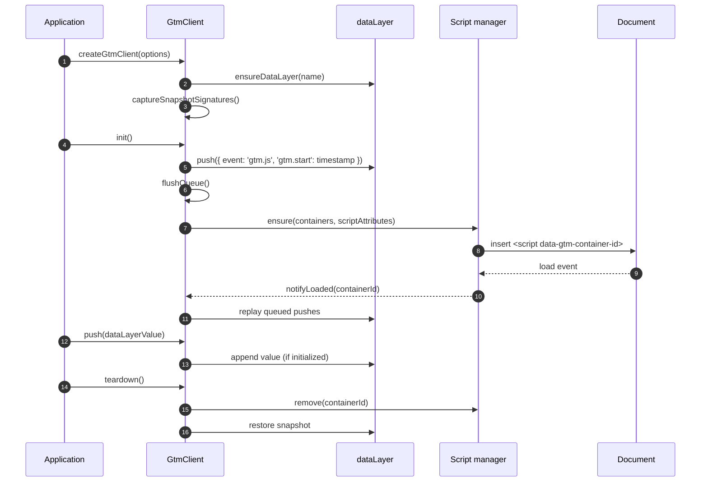

# GTM loader lifecycle (sequence)

**Key takeaways**

- The GTM client captures the initial `dataLayer` contents before mutating them so teardown can restore the original state.
- Script deduplication is owned by the `ScriptManager`, which tags every injected `<script>` with a deterministic `data-gtm-container-id` attribute.
- Queue flushing happens immediately after initialization. Any pushes issued before `init()` are replayed in FIFO order using the captured queue.
- Teardown removes injected scripts and replays the captured snapshot so tests and microfrontends can reclaim the global state cleanly.
